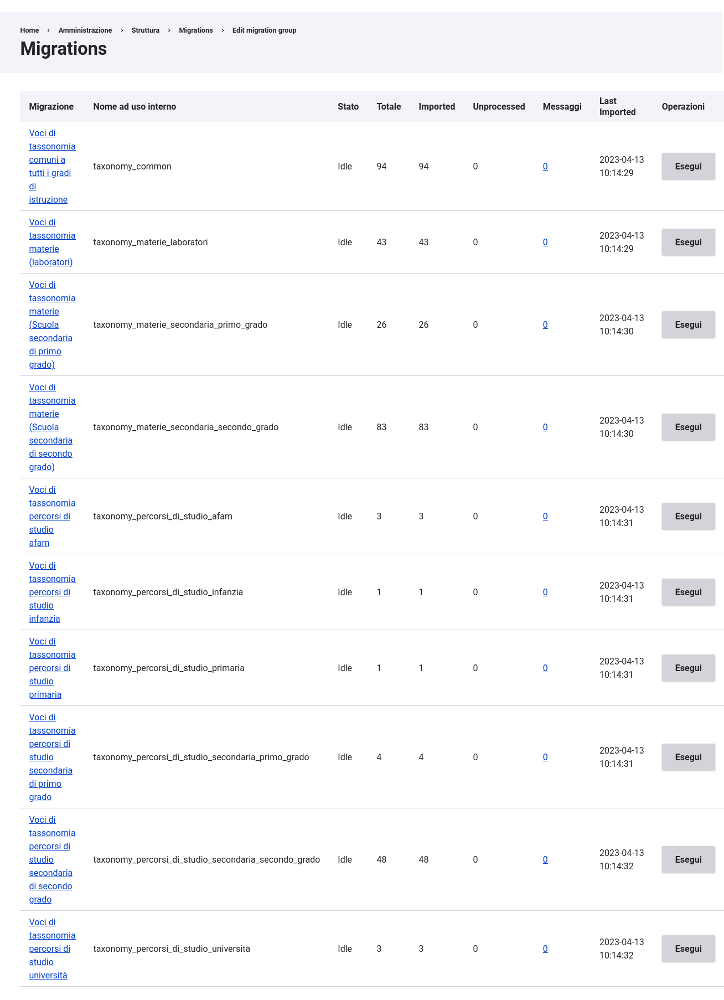
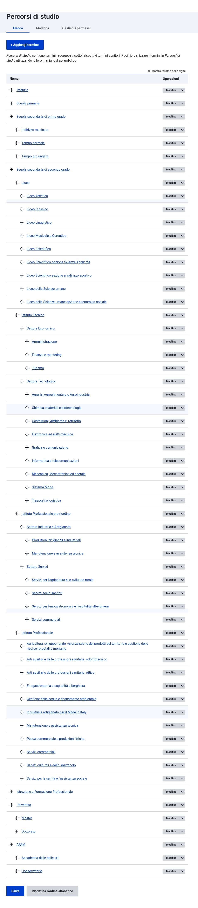

# Sunchronìzo lexikà
Sunchronìzo lexikà è modulo Drupal che importa le voci di tassonomia utilizzate dalle scuole.
Questo modulo usa `drupal/migrate` per importare le voci presenti nel repository [Krène](https://github.com/ouitoulia/krene) 

## Installazione
Per aggiungere e installare il modulo alla tua installazione esegui:
```
$ composer require ouitoulia/sunchronizo_lexika
$ drush -y en sunchronizo_lexika
```
Questo è il risultato



## Uso del modulo
Puoi utilizzare il modulo:
- da interfaccia grafica;
- da CLI se hai bisogno di automatizzare l'installazione o l'aggiornamento.

In entrambi i casi, leggi la documentazione del modulo 
Drupal `migrate` per maggiori dettagli.

Di seguito un esempio delle voci importate nel vocabolario "Percorsi di studio"


